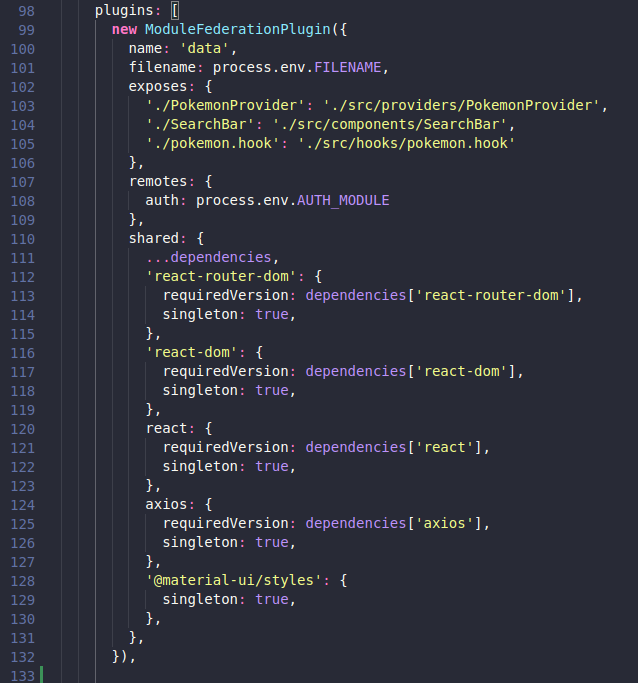
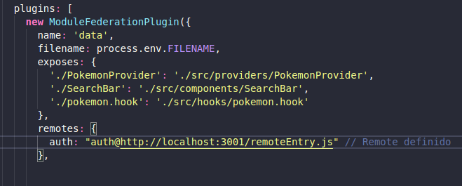
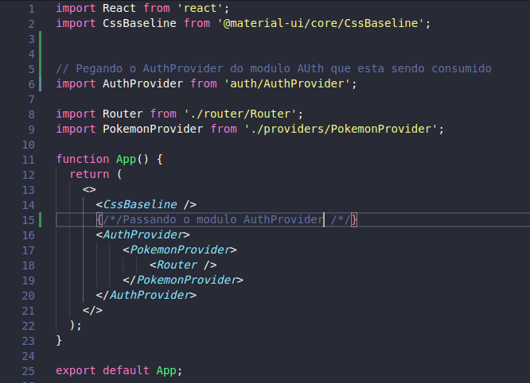

# :computer: ModuleFederation
  
  Usando ModuleFedaration para compartilhar micro-frontends entre si e fazer uma aplicação completa. 

## :question: O que é module federation?

- É um jeito de compartilhar informações entre aplicações, na qual cada aplicação pode exportar a funcionalidade que deseja consumir ou compartilhar. Essas aplicações tambem são conhecidas como micro-frontends.

## :information_source: Sobre o projeto

  - O projeto possui 3 micro-frontends: Pokemon, Auth e Data. Cada um deles tem sua responsabilidade, no qual o micro front-end de Pokemon faz uma lista do pokemons, o auth cuida da parte de autenticação e o data fornece as informações que são coletadas da api e distribui atraves do context api.
  
## :mortar_board: Como compartilhar informações para outras aplicações?

  - Todo micro-frontend tem suas proprias dependencias e seu arquivo `webpack.config.js`, e nesse arquivos que vão ser definidos quais informações vão ser compartilhadas e recebidas de outros micro-frontends.
  
  - Para compartilhas informações dentro desse arquivos primeiro voce ira definir um array de dependencias chamado plugins, depois você tem que extrair o moduleFederationplugin. Apos isso voce pode instanciar a classe moduleFederationplugin e passar as configurações dejesadas como argumentos.
  
  Exemplo: 
    
   
  
 #### `filename`
 
 - Não é obrigatorio, mas é bom colocar pois esse nome vai ser usado para consumi-lo.
      
 #### `exposes`
 
  - Serve para expor os modulos para outras aplicações. No lugar da chave é colocado o nome que ele vai ser chamado quando ele for consumido, no valor coloca o caminho para chegar nele na sua aplicação. 
   
 #### `remotes`
 
 - É usado para mostrar o que vai ser consumido nesse micro-frontend. Então na chave você passa o nome do module que vai ser consumido e no valor voce passa onde esta sendo compartilhado esse valor.
 
 #### `shared`

 - É para listar as dependencias que estão no `package.json`.
 
 
 ## Como consumir as informações que foram compartilhadas pelo Module Federation?
 
 - Primeiro tem que definir o module que vai ser consumido no `remotes` nas configurações do `webpack.config.js` que ja foi explicado anteriormente. Agora
 voce entra no arquivo que você deseja consumir o module e importe o module com a função desejada. 
 
  Exemplo do `webpack.config.js`: 
  
   
   
  Exemplo consumindo o modulo: 
  
   
  
